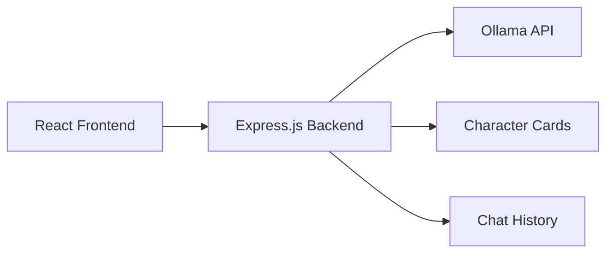

# AI Character Chat Architecture

## System Overview



## Project Structure

```
ai-character-chat/
├── backend/
│   ├── server.js
│   ├── config/
│   ├── controllers/
│   ├── routes/
│   ├── services/
│   └── characters/
│       └── *.md (character card files)
├── frontend/
│   ├── public/
│   └── src/
│       ├── components/
│       ├── App.js
│       └── index.js
├── package.json
└── README.md
```

## Backend Design

### Express.js Server

- REST API endpoints for chat interactions
- Character management system
- Integration with Ollama API
- Session management for chat history

### Character System

- Character cards stored as markdown files
- Each character has:
  - Name and description
  - Personality traits
  - Background story
  - Behavioral guidelines
  - Example dialogues

### Ollama Integration

- HTTP client to communicate with local Ollama instance
- Model configuration options
- Error handling for API failures

## Frontend Design

### React Components

- Chat interface with message history
- Character selection panel
- Message input field
- Real-time response display

### State Management

- Current character selection
- Chat history
- Loading states for API requests

## Extensibility for Future RPG Features

### Database Integration

- Character data migration from markdown to database
- Player profiles and progression tracking
- Game state persistence

### Game Mechanics

- Character relationship system
- Quest and dialogue trees
- Inventory and skill systems
- World state management

## API Endpoints

### Chat

- `POST /api/chat` - Send message to character
- `GET /api/characters` - List available characters
- `GET /api/characters/:id` - Get character details

### Future Extensions

- `POST /api/characters` - Create new character
- `PUT /api/characters/:id` - Update character
- `POST /api/quests` - Manage quests (future)

## Technology Stack

- **Backend**: Node.js with Express.js
- **Frontend**: React.js
- **AI Service**: Ollama (local LLM)
- **Character Storage**: Markdown files (extensible to database)
- **Communication**: REST API with JSON

## Deployment Considerations

- Docker configuration for easy deployment
- Environment variable configuration
- Ollama model management
- Static file serving for frontend

## Security Considerations

- Input validation and sanitization
- Rate limiting for API endpoints
- CORS configuration
- Error handling without exposing internal details