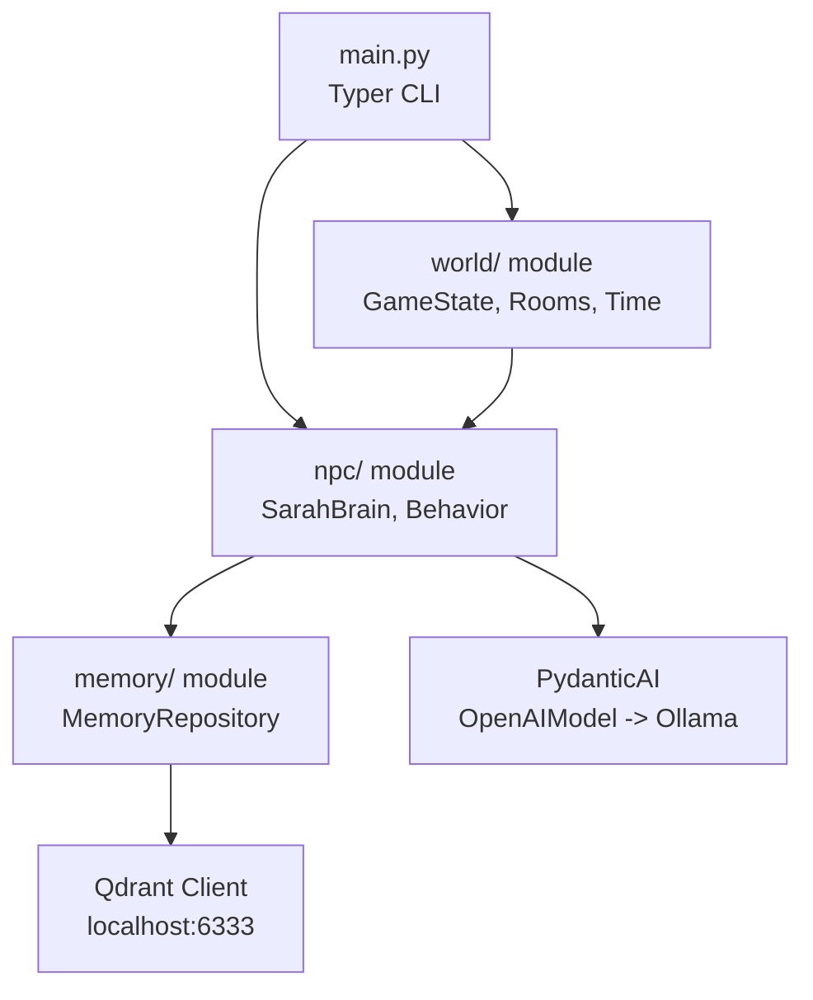
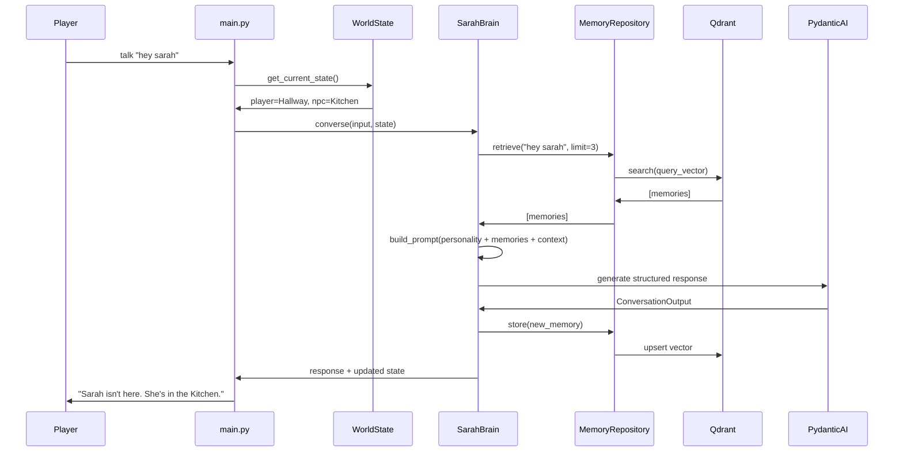

# NPC Memory Prototype - Stage 1 Implementation Plan

## Clarifications Received
- **Ollama model**: `qwen3.6:27b`
- **Time system**: Variable game time advancing with player actions (not real-time)
- **Qdrant**: Auto-create collection on first run

## Architecture Overview



## Module Breakdown

### 1. `config.py` (root)
- Pydantic `Settings` class loading `.env`
- Fields: `OLLAMA_URL`, `OLLAMA_MODEL`, `QDRANT_URL`, `QDRANT_COLLECTION`

### 2. `world/` module
- **`models.py`**: Pydantic models
  - `Room` (name, description, contents)
  - `GameTime` (hour, minute, day) with comparison helpers
  - `WorldState` (player_room, current_time, npc_location)
- **`rooms.py`**: Static room definitions (Kitchen, Bedroom, Hallway)
- **`state.py`**: `GameState` class managing world state, time advancement, room transitions

### 3. `npc/` module
- **`models.py`**: Pydantic models
  - `NPCState` (name, personality, current_room, schedule)
  - `ConversationInput` (player_message, room_context, time_context)
  - `ConversationOutput` (response, mood_delta, memory_entries)
- **`brain.py`**: `SarahBrain` class
  - Uses PydanticAI with Ollama backend
  - Builds system prompt from personality + memories + context
  - Returns structured `ConversationOutput`
- **`behavior.py`**: `NPCBehavior` class
  - Schedule logic: Kitchen at 07:00, Bedroom at 22:00, random otherwise
  - Spatial awareness: checks if player is in same room before responding
  - Time advancement integration

### 4. `memory/` module
- **`repository.py`**: `MemoryRepository` abstract protocol/interface
  - `store(entry: MemoryEntry) -> None`
  - `retrieve(query: str, limit: int = 3) -> list[MemoryEntry]`
  - `get_recent(limit: int = 3) -> list[MemoryEntry]`
- **`qdrant.py`**: `QdrantMemoryRepository` implementation
  - Auto-creates collection with vector size matching Ollama embeddings
  - Uses `nomic-embed-text` or similar via Ollama for embeddings
  - Stores: conversation text, summary flag, timestamp, room

### 5. `main.py`
- Typer CLI with commands:
  - `look` / `look around` - describe current room and contents
  - `go <room>` - move to another room (advances time)
  - `talk "<message>"` / `ask sarah "<message>"` - converse with Sarah
  - `where` - show Sarah's current location
  - `time` - show current game time
  - `exit` / `quit` - end session
- Game loop: parse input -> update time -> move NPC if needed -> process command

### 6. `tests/` module
- `test_world.py`: Room transitions, time advancement, state mutations
- `test_npc.py`: Schedule logic, spatial constraints, personality prompts
- `test_memory.py`: Mock memory repository, Qdrant integration tests (optional, with skipif)

## Data Flow: Conversation



## Time System Design
- Game starts at 07:00 (Day 1)
- Each action advances time by a variable amount:
  - `look`: 1 minute
  - `go`: 5 minutes
  - `talk`: 2 minutes
- NPC schedule checked after each time advancement
- If time crosses a schedule boundary, NPC teleports to scheduled room

## Memory Strategy
- **Short-term**: Last 3 conversations kept in memory as full text
- **Long-term**: Older conversations summarized and stored in Qdrant
- **Retrieval**: Before each conversation, query Qdrant with player message + current context
- **Storage**: Each conversation turn stored as a `MemoryEntry` with embedding

## Key Interfaces

```python
# memory/repository.py
class MemoryRepository(Protocol):
    def store(self, entry: MemoryEntry) -> None: ...
    def retrieve(self, query: str, limit: int = 3) -> list[MemoryEntry]: ...
    def get_recent(self, limit: int = 3) -> list[MemoryEntry]: ...

# npc/brain.py
class SarahBrain:
    def __init__(self, memory: MemoryRepository, config: Settings): ...
    def converse(self, input: ConversationInput, state: WorldState) -> ConversationOutput: ...

# npc/behavior.py
class NPCBehavior:
    def __init__(self, schedule: dict[Time, Room]): ...
    def update_location(self, state: NPCState, current_time: GameTime) -> Room: ...
    def can_interact(self, npc_room: Room, player_room: Room) -> bool: ...
```

## File Structure

```
.
├── main.py
├── config.py
├── pyproject.toml
├── .env.example
├── README.md
├── world/
│   ├── __init__.py
│   ├── models.py
│   ├── rooms.py
│   └── state.py
├── npc/
│   ├── __init__.py
│   ├── models.py
│   ├── brain.py
│   └── behavior.py
├── memory/
│   ├── __init__.py
│   ├── repository.py
│   └── qdrant.py
└── tests/
    ├── __init__.py
    ├── test_world.py
    ├── test_npc.py
    └── test_memory.py
```

## Dependencies (pyproject.toml)
- `pydantic-ai`
- `qdrant-client`
- `typer`
- `pydantic-settings`
- `python-dotenv`
- `pytest`
- `pytest-asyncio`

## Next Steps
Switch to Code mode to implement this plan module by module.
